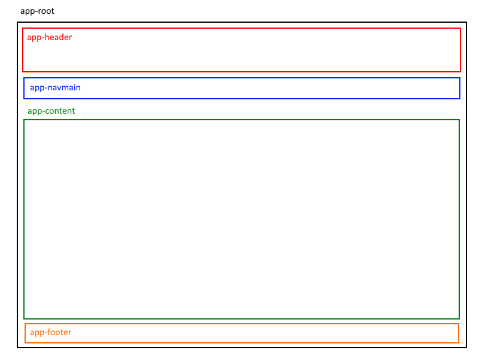

## Angular routing example

> This document is being edited.  
> This notice will be removed when the edits are complete.

In this document, you will configure routing in an app that has several components. It's the app that was created in the [Angular components example](angular-components-example) document. Here, we will make the changes to support routing.

The goal is to become comfortable with the routing foundations and configuration, and the process of implementing routing in an app. 

 

### Getting started (more to come)

Here's what we're trying to do...  

? sidebar (terminology)

 

TBA

 