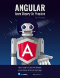
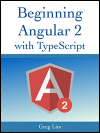

## Learning resources

This page has information about and links to learning resources that you will use in this course.

> Tentative; to be discussed and negotiated

 

### Previous courses

This is the third course in the web programming sequence. 

Therefore, continue to use the content from the courses that you have successfully completed:

WEB222 - Web Programming Principles

WEB322 - Web Programming Tools and Frameworks

 

### Developer tools

[Visual Studio Code](https://code.visualstudio.com/)  
Browsers (current versions of Chrome, Firefox, Safari, Opera, Edge)  
Browser dev tools  
HTTP inspector (e.g. [Postman](https://www.getpostman.com/))  

You will need one or more devices. A College or personal desktop or laptop, and (likely) a personal mobile device (e.g. a smartphone).

Other editors...

[Plunker](https://plnkr.co/)

JSFiddle, JS Bin

FYI - The Monaco Editor is the code editor that powers VS Code. [Info page is here.](https://microsoft.github.io/monaco-editor/index.html)  

 

### Required textbook

None. 

This is a web programming course. Therefore, the best source for content is on the web!

 

### Required online resources

There are several required online resources:

The **Mozilla Developer Network** (MDN) is vast, with thousands of documents. It is a trusted and authoritative source for web developer information. Of interest:

* [HTML5](https://developer.mozilla.org/en-US/docs/Web/Guide/HTML) Guide, including [HTML Forms Guide](https://developer.mozilla.org/en-US/docs/Web/Guide/HTML/Forms), and the [HTML5 Element List](https://developer.mozilla.org/en-US/docs/Web/Guide/HTML/HTML5/HTML5_element_list)
* [CSS Reference](https://developer.mozilla.org/en-US/docs/Web/CSS)
* [JavaScript Reference](https://developer.mozilla.org/en-US/docs/Web/JavaScript)
* [DOM Reference](https://developer.mozilla.org/en-US/docs/DOM)

Official [Angular Documentation](https://angular.io/docs)

Angular CLI videos on YouTube, by [Codevolution](https://www.youtube.com/channel/UC80PWRj_ZU8Zu0HSMNVwKWw/videos)

JavaScript:  
MDN, and...  
[You Don't Know JavaScript](https://github.com/getify/You-Dont-Know-JS) book series, free; looks pretty good

Node.js and Express.js:  
[nodejitsu](https://docs.nodejitsu.com/) - looks pretty good

Oh, and you should must know (and love!) the series of RFCs that describe HTTP, [7230](https://tools.ietf.org/html/rfc7230) through 7235. If you want a friendlier introduction to [HTTP](https://en.wikipedia.org/wiki/Hypertext_Transfer_Protocol), read its Wikipedia article.

 

### Other resources

[W3C Standards](https://www.w3.org/standards/) - a very good resource

Google [web developers](https://developers.google.com/web/fundamentals/) content

[Angular 4: From Theory to Practice](https://www.amazon.ca/dp/B01N9S0CZN/ref=docs-os-doi_0) - Asim Hussain (free!)  
  

[Beginning Angular 2](https://www.amazon.com/Beginning-Angular-Typescript-updated-ebook/dp/B01N9ZUHBA/) - Greg Lim  

### Other (to be discussed, organized, edited)

**Common / core**  
JavaScript  
HTML  
CSS

**TypeScript**  
Strong typing  
Tooling  
Enables large apps to be built in a more reliable manner  

**Front end frameworks**  
Angular (which is NOT AngularJS, a legacy technology)  
Alternatives:  
* React  
* Knockout  
* Aurelia  
* and many others  

**State management**  
TBA (flux, redux, ?)  
[JSON data API](http://jsonplaceholder.typicode.com)  

**To be categorized**  
RxJS (ReactiveX library for JavaScript) - compose async and event-based programs using observables and LINQ-style queries  
Was known as "Reactive Extensions"  
[reactivex.io - official docs](http://reactivex.io/rxjs/manual/overview.html#introduction)  

**HTML and CSS**  
[CSS Selectors](https://developer.mozilla.org/en-US/docs/Web/CSS/CSS_Selectors) - MDN  
[CSS Attribute Selectors](https://developer.mozilla.org/en-US/docs/Web/CSS/Attribute_selectors) - MDN  
